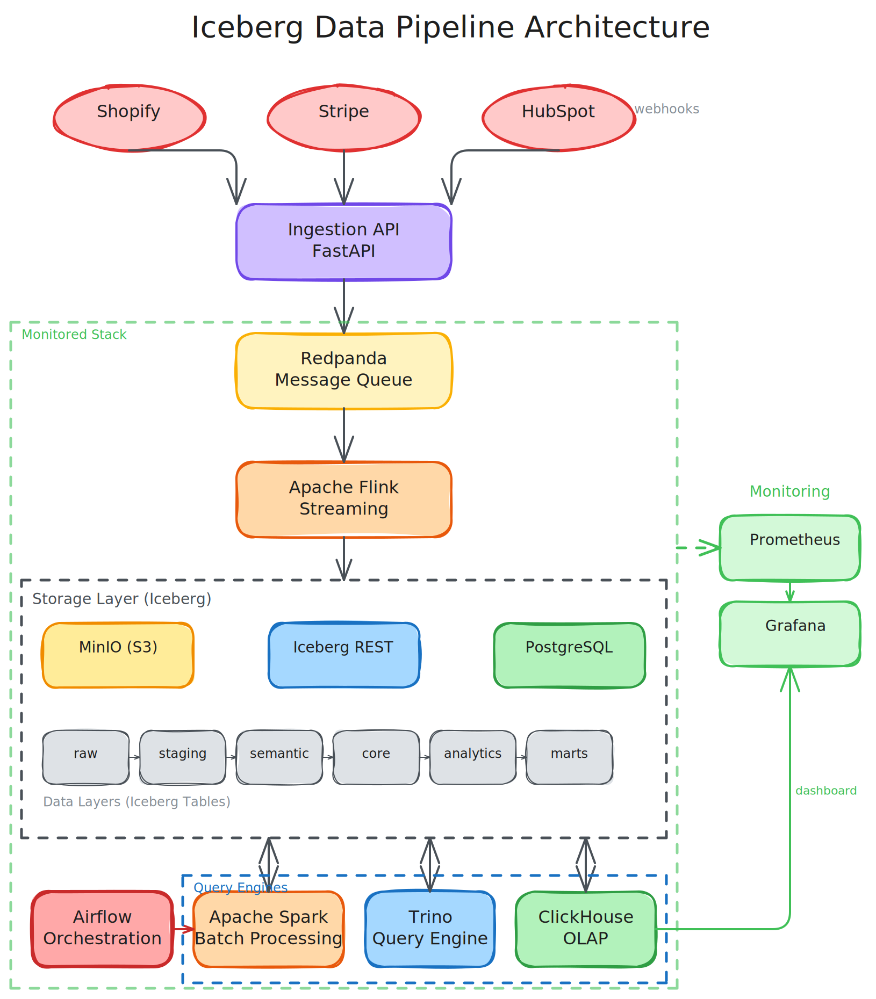
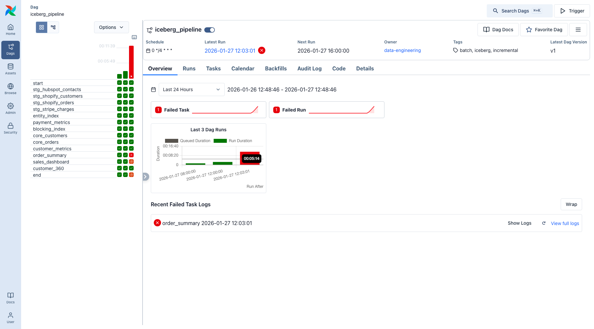
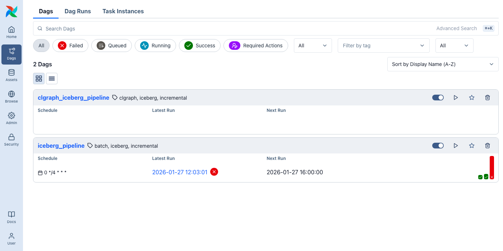
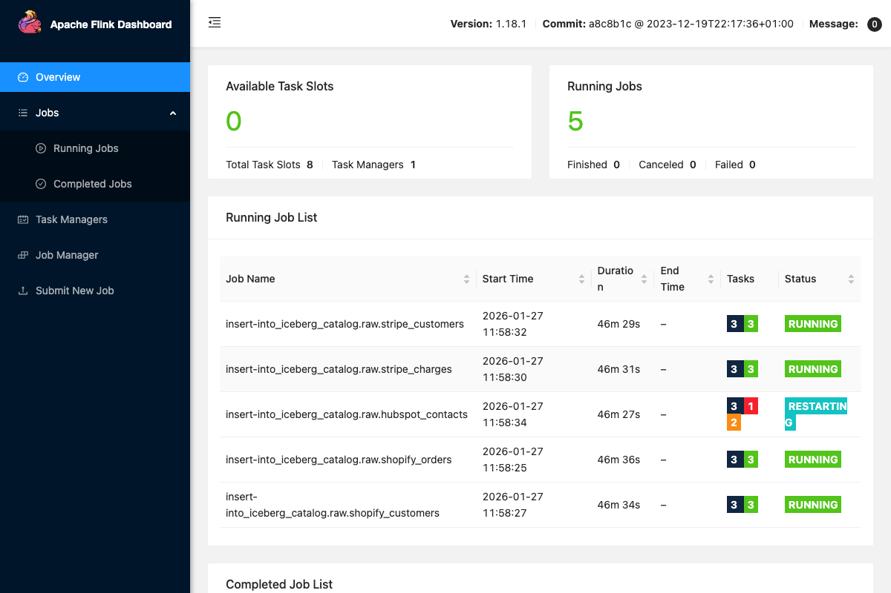
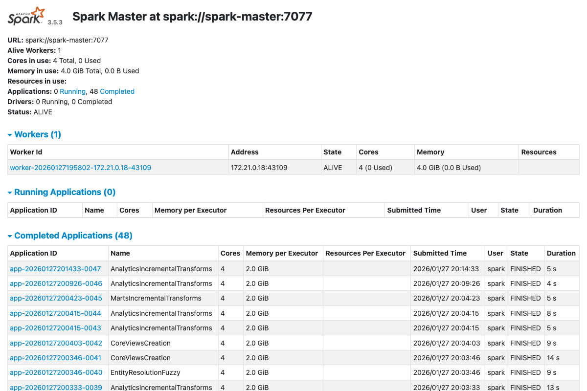
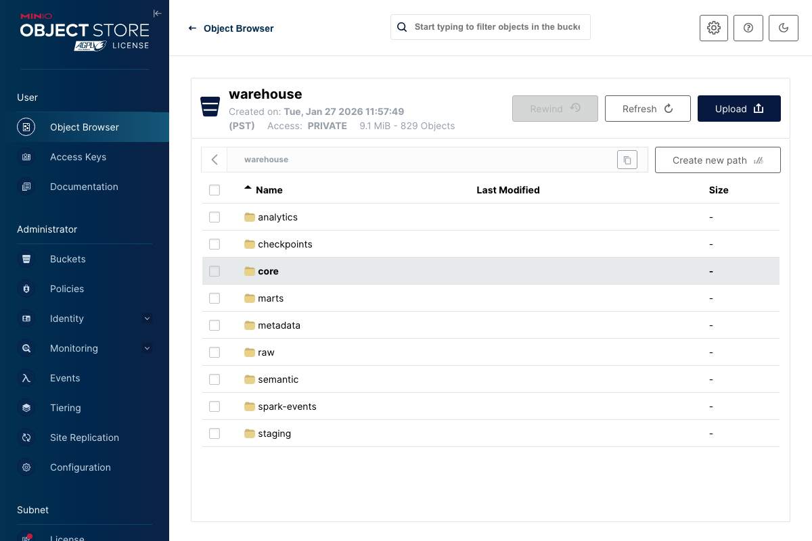
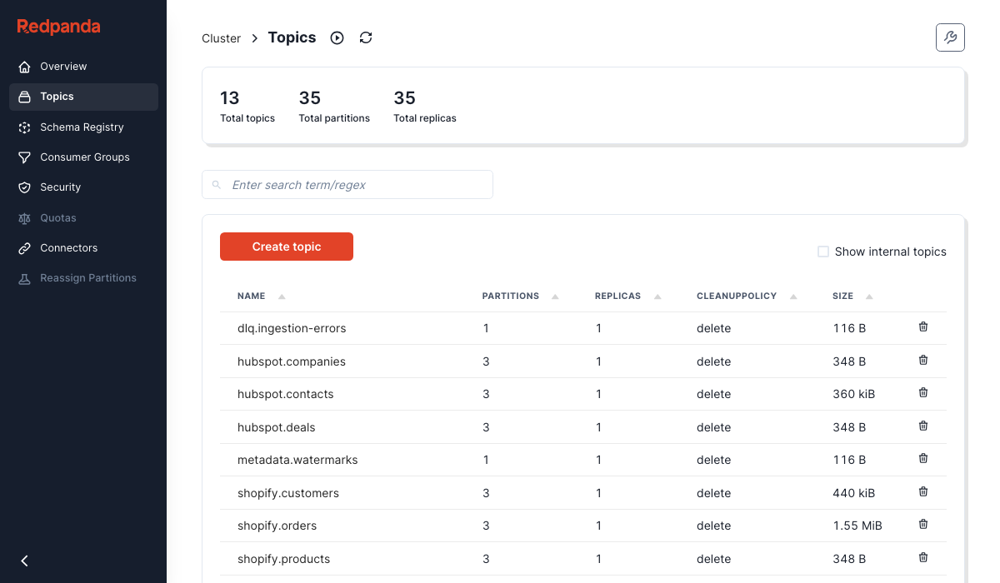
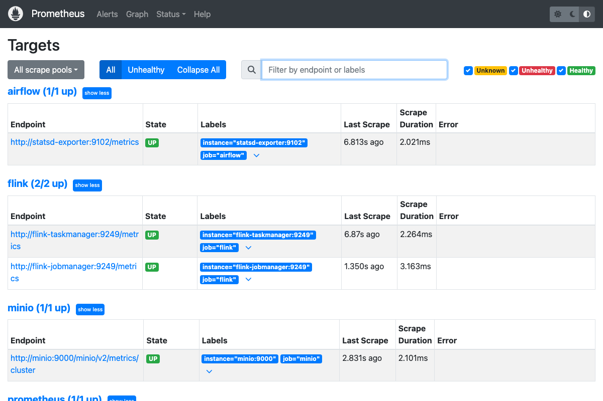
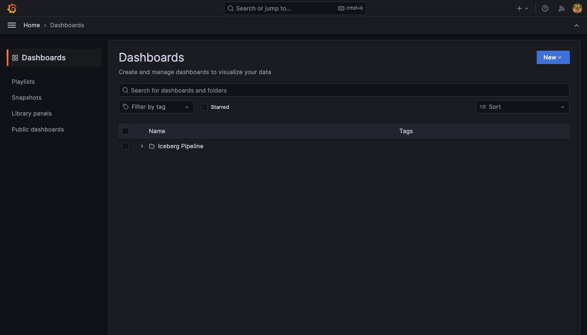

# Iceberg + Redpanda + Flink + Spark + Trino + ClickHouse + Airflow + Grafana Pipeline

This is a production-style(but not production-ready) data platform combining real-time streaming and batch processing with Apache Iceberg as the unified storage layer. Demonstrates entity resolution across Shopify, Stripe, and HubSpot data sources.

**DISCLOSURE:Majority of the content are written with Claude(with human guided) ... as you can expected.**

## Architecture Diagram



## Who This Project Is For

This repository is **not a beginner tutorial**. It assumes you already understand:

- **Data warehouse concepts**: Dimensional modeling, fact/dimension tables, slowly changing dimensions
- **ETL fundamentals**: Extract-transform-load patterns, batch vs streaming trade-offs
- **SQL proficiency**: Window functions, CTEs, joins, aggregations
- **Docker basics**: Containers, volumes, compose files, networking
- **Distributed systems concepts**: Message queues, eventual consistency

However, with coding agents, the barrier is much lower now. 

**Target audience:**
- Engineers who have read articles about some of the technologies( Iceberg, Flink, or modern data stacks) used in this repo but haven't seen them work together
- Teams evaluating architecture patterns for multi-source data integration and want to see live action before fully committing engineering resources
- Teams building greenfield projects that want some jump starts
- Anyone who wants a working reference implementation rather than toy examples

## Why This Demo Exists

When I first time learned about Apache Iceberg, I feel it's a great idea and wanted to give it a try. Once I passed the quickstart section, like every other tools, I was struggled to find a personal side project that is suitable for that. There are many beginner tutorials or conceptual articles available online explaining:

- "What is Apache Iceberg?" Without showing us how to wire it with Flink streaming input AND Spark batch process and consumed by different engines.
- "Incremental processing patterns" Without telling us how to do watermark tables, partition-level updates, and failure recovery implemented together
- "Entity resolution techniques" Without explaining how blocking indexes and fuzzy matching work in a real pipeline

Thus, I started this repo. It's a **working reference implementation** that you can run locally, inspect, and adapt—not a simplified teaching example.

## Documentation

| Document | Purpose |
|----------|---------|
| [README.md](./README.md) | Quick start and overview (this file) |
| [ARCHITECTURE.md](./ARCHITECTURE.md) | System design, infrastructure rationale, data layer philosophy |
| [infrastructure/README.md](./infrastructure/README.md) | Service-by-service guide with tool selection rationale |
| [docs/RUNBOOK.md](./docs/RUNBOOK.md) | Operational procedures and troubleshooting |

## Overview

This demo simulates a modern data platform that:
- Ingests data from **Shopify**(e-commerce store), **Stripe**(payment), and **HubSpot**(CRM) via webhooks
- Stores data in **Apache Iceberg** tables with PostgreSQL catalog backend
- Uses **Flink SQL** for real-time streaming from Kafka to Iceberg raw layer
- Uses **Spark** for batch processing through staging → semantic → analytics → marts
- Implements **entity resolution** to unify customers across sources
- Orchestrates pipelines with **Apache Airflow**
- Supports queries from **Trino**, **Spark**, and **ClickHouse**

## Prerequisites

- **Docker** and **Docker Compose**
- **Python 3.9+** (for mock data generation)
- At least **16GB RAM** available for Docker (8GB is NOT enough)
- Ports available: 8080-8090, 9000-9001, 19092 (or you can change them)

## Quick Start

### Option 1: Full Reset and Validation (Recommended)

Run the complete setup with validation:

```bash
./scripts/full_reset_and_validate.sh
```

This script will:
1. Stop all containers and remove data volumes
2. Start fresh infrastructure (MinIO, Redpanda, Iceberg REST, Flink, Spark, Airflow, Trino)
3. Submit Flink streaming jobs to write raw data to Iceberg
4. Post mock data to webhook endpoints
5. Run Spark batch jobs for all data layers (staging → semantic → analytics → marts)
6. Trigger and validate the Airflow DAG
7. Display a validation summary

### Option 2: Step-by-Step Setup

#### 1. Start Infrastructure

```bash
cd infrastructure
docker-compose up -d
```

Wait for all services to be healthy:
```bash
docker-compose ps
```

#### 2. Initialize the Iceberg Catalog

The Flink jobs will automatically create databases when they run. You can also manually create them:

```bash
docker exec iceberg-flink-jobmanager /opt/flink/bin/sql-client.sh embedded -e "
    CREATE CATALOG iceberg_catalog WITH (
        'type' = 'iceberg',
        'catalog-type' = 'rest',
        'uri' = 'http://iceberg-rest:8181',
        'warehouse' = 's3a://warehouse/',
        'io-impl' = 'org.apache.iceberg.aws.s3.S3FileIO',
        's3.endpoint' = 'http://minio:9000',
        's3.path-style-access' = 'true',
        's3.access-key-id' = 'admin',
        's3.secret-access-key' = 'admin123'
    );
    USE CATALOG iceberg_catalog;
    CREATE DATABASE IF NOT EXISTS raw;
    CREATE DATABASE IF NOT EXISTS staging;
    CREATE DATABASE IF NOT EXISTS semantic;
    CREATE DATABASE IF NOT EXISTS analytics;
    CREATE DATABASE IF NOT EXISTS marts;
"
```

#### 3. Submit Flink Streaming Jobs

```bash
# Submit all raw layer ingestion jobs
for job in shopify_orders shopify_customers stripe_charges hubspot_contacts; do
    docker exec iceberg-flink-jobmanager /opt/flink/bin/sql-client.sh embedded \
        -f "/opt/flink/jobs/${job}_full.sql" &
    sleep 2
done
```

#### 4. Generate and Post Mock Data

```bash
# Install dependencies
python3 -m venv .venv
source .venv/bin/activate
pip install click httpx faker

# Post mock data to webhook endpoints
python scripts/post_mock_data.py \
    --url http://localhost:8090 \
    --shopify-customers 50 \
    --shopify-orders 100 \
    --stripe-charges 80 \
    --hubspot-contacts 40 \
    --seed 42
```

#### 5. Run Spark Batch Jobs

```bash
# Staging layer
docker exec iceberg-spark-master /opt/spark/bin/spark-submit \
    --master spark://spark-master:7077 \
    --conf 'spark.sql.extensions=org.apache.iceberg.spark.extensions.IcebergSparkSessionExtensions' \
    --conf 'spark.sql.catalog.iceberg=org.apache.iceberg.spark.SparkCatalog' \
    --conf 'spark.sql.catalog.iceberg.type=rest' \
    --conf 'spark.sql.catalog.iceberg.uri=http://iceberg-rest:8181' \
    --conf 'spark.sql.catalog.iceberg.warehouse=s3a://warehouse/' \
    --conf 'spark.sql.catalog.iceberg.io-impl=org.apache.iceberg.aws.s3.S3FileIO' \
    --conf 'spark.sql.catalog.iceberg.s3.endpoint=http://minio:9000' \
    --conf 'spark.sql.catalog.iceberg.s3.access-key-id=admin' \
    --conf 'spark.sql.catalog.iceberg.s3.secret-access-key=admin123' \
    --conf 'spark.sql.catalog.iceberg.s3.path-style-access=true' \
    /opt/spark/jobs/staging_batch.py --table all --mode full

# Entity resolution (semantic layer)
docker exec iceberg-spark-master /opt/spark/bin/spark-submit \
    --master spark://spark-master:7077 \
    # ... same configs ...
    /opt/spark/jobs/entity_backfill.py --mode initial

# Analytics layer
docker exec iceberg-spark-master /opt/spark/bin/spark-submit \
    # ... same configs ...
    /opt/spark/jobs/analytics_incremental.py --table all --mode full

# Marts layer
docker exec iceberg-spark-master /opt/spark/bin/spark-submit \
    # ... same configs ...
    /opt/spark/jobs/marts_incremental.py --table all --mode full
```

#### 6. Trigger Airflow DAG

```bash
docker exec iceberg-airflow-scheduler airflow dags trigger iceberg_pipeline
```

## Service URLs

| Service | URL | Credentials |
|---------|-----|-------------|
| Airflow | http://localhost:8086 | admin / admin123 |
| Grafana | http://localhost:3000 | admin / admin123 |
| Prometheus | http://localhost:9090 | - |
| Spark Master | http://localhost:8084 | - |
| Flink Dashboard | http://localhost:8083 | - |
| MinIO Console | http://localhost:9001 | admin / admin123 |
| Redpanda Console | http://localhost:8080 | - |
| Trino | http://localhost:8085 | - |
| Ingestion API | http://localhost:8090 | - |

## Observing the Pipeline in Action

Once the pipeline is running, we can watch data flow through each component in real-time.

### Watch Data Flow End-to-End

**1. Ingestion → Kafka (Redpanda Console)**
- Open http://localhost:8080
- Navigate to Topics → select `shopify.orders`
- Watch messages arrive as webhooks are received
- See consumer lag if Flink falls behind

**2. Kafka → Raw Layer (Flink Dashboard)**
- Open http://localhost:8083
- View running jobs and their throughput
- Check checkpoint status for exactly-once guarantees
- Monitor backpressure indicators

**3. Raw → Staging → Analytics (Spark Master)**
- Open http://localhost:8084
- Watch batch jobs execute
- View executor metrics, shuffle read/write
- Check completed/failed applications

**4. Pipeline Orchestration (Airflow)**
- Open http://localhost:8086 (admin/admin123)
- View DAG: `iceberg_pipeline`
- See task dependencies and execution order
- Check task logs for any failures

**5. Storage (MinIO Console)**
- Open http://localhost:9001 (admin/admin123)
- Browse `warehouse` bucket
- See Iceberg data files organized by table
- Watch file count grow as data arrives

### Monitoring Dashboards (Grafana)

Open http://localhost:3000 (admin/admin123) for pre-built dashboards:

| Dashboard | What It Shows |
|-----------|---------------|
| **Streaming Metrics** | Flink checkpoint duration, records processed, backpressure |
| **Batch Metrics** | Spark job duration, shuffle I/O, executor memory |
| **Pipeline Overview** | End-to-end latency, table row counts, job success rates |

We should see numbers are increasing in the **Streaming Metrics** in real time.

### Quick Health Check

Run this to verify all components are working:

```bash
# Check service health
curl -s http://localhost:9000/minio/health/live && echo "MinIO: OK"
curl -s http://localhost:8181/v1/config | jq -r '.defaults."warehouse"' && echo "Iceberg Catalog: OK"
curl -s http://localhost:8083/jobs/overview | jq -r '.jobs | length' | xargs -I {} echo "Flink Jobs: {} running"
docker exec iceberg-redpanda rpk topic list | wc -l | xargs -I {} echo "Kafka Topics: {}"

# Check data counts across layers
docker exec iceberg-trino trino --execute "
SELECT 'raw.shopify_orders' as tbl, COUNT(*) as cnt FROM iceberg.raw.shopify_orders
UNION ALL SELECT 'staging.stg_shopify_orders', COUNT(*) FROM iceberg.staging.stg_shopify_orders
UNION ALL SELECT 'analytics.order_summary', COUNT(*) FROM iceberg.analytics.order_summary
"
```

## UI Screenshots

### Airflow DAG

The pipeline orchestration showing task dependencies and run status:



DAG list showing both pipelines:



### Flink Streaming

Real-time streaming jobs consuming from Kafka and writing to Iceberg:



### Spark Master

Batch processing cluster status:



### MinIO Storage

Object storage browser showing Iceberg data files:



### Redpanda Console

Kafka topics receiving webhook events:



### Monitoring

Prometheus targets for metrics collection:



Grafana dashboards:



---

## Querying Data

### Using Trino

```bash
docker exec -it iceberg-trino trino

# List all tables
SHOW TABLES FROM iceberg.staging;

# Query staging data
SELECT * FROM iceberg.staging.stg_shopify_orders LIMIT 10;

# Query analytics
SELECT * FROM iceberg.analytics.order_summary LIMIT 10;
```

### Using Spark SQL

```bash
docker exec -it iceberg-spark-master /opt/spark/bin/spark-sql \
    --conf 'spark.sql.catalog.iceberg=org.apache.iceberg.spark.SparkCatalog' \
    --conf 'spark.sql.catalog.iceberg.type=rest' \
    --conf 'spark.sql.catalog.iceberg.uri=http://iceberg-rest:8181'
```

## Data Pipeline Layers

| Layer | Description | Tables |
|-------|-------------|--------|
| **Raw** | Append-only webhook events | `raw.shopify_orders`, `raw.shopify_customers`, `raw.stripe_charges`, `raw.hubspot_contacts` |
| **Staging** | Cleaned and typed data | `staging.stg_shopify_orders`, `staging.stg_shopify_customers`, `staging.stg_stripe_charges`, `staging.stg_hubspot_contacts` |
| **Semantic** | Entity resolution | `semantic.entity_index`, `semantic.blocking_index` |
| **Analytics** | Aggregated metrics | `analytics.customer_metrics`, `analytics.order_summary`, `analytics.payment_metrics` |
| **Marts** | Business-ready views | `marts.customer_360`, `marts.sales_dashboard_daily` |

## Configuration

### Environment Variables

Create `infrastructure/.env` to customize:

```bash
# MinIO
MINIO_ROOT_USER=admin
MINIO_ROOT_PASSWORD=admin123

# Airflow
AIRFLOW_POSTGRES_USER=airflow
AIRFLOW_POSTGRES_PASSWORD=airflow123

# Mock Data Scale
SHOPIFY_CUSTOMERS=50
SHOPIFY_ORDERS=100
STRIPE_CUSTOMERS=30
STRIPE_CHARGES=80
HUBSPOT_CONTACTS=40
```

## Troubleshooting

### Common Issues

**1. Services fail to start**
```bash
# Check logs
docker-compose logs -f <service-name>

# Restart specific service
docker-compose restart <service-name>
```

**2. Flink jobs fail**
```bash
# Check Flink logs
docker logs iceberg-flink-jobmanager

# Check if Kafka topics exist
docker exec iceberg-redpanda rpk topic list
```

**3. Spark jobs fail with S3 errors**

Ensure all Iceberg S3 configurations are passed:
```bash
--conf 'spark.sql.catalog.iceberg.s3.endpoint=http://minio:9000'
--conf 'spark.sql.catalog.iceberg.s3.access-key-id=admin'
--conf 'spark.sql.catalog.iceberg.s3.secret-access-key=admin123'
--conf 'spark.sql.catalog.iceberg.s3.path-style-access=true'
```

**4. Tables not found**
```bash
# Check Iceberg catalog
docker exec iceberg-airflow-postgres psql -U airflow -d iceberg_catalog -c \
    "SELECT table_namespace, table_name FROM iceberg_tables;"
```

### Reset Everything

```bash
./scripts/full_reset_and_validate.sh
```

Or manually:
```bash
cd infrastructure
docker-compose down --remove-orphans
docker volume rm iceberg-demo-minio-data iceberg-demo-redpanda-data \
    iceberg-demo-flink-checkpoints iceberg-demo-airflow-postgres-data
docker-compose up -d
```

## Directory Structure

```
iceberg-incremental-demo/
├── README.md                    # This file
├── ARCHITECTURE.md              # Detailed architecture documentation
├── infrastructure/              # Docker services
│   ├── docker-compose.yml       # All service definitions
│   ├── postgres/                # PostgreSQL init scripts
│   ├── redpanda/                # Kafka topic initialization
│   ├── flink/                   # Flink configuration
│   └── airflow/                 # Airflow configuration
├── datagen/                     # Mock data generation
│   └── providers/               # Source-specific Faker providers
├── jobs/                        # ETL jobs
│   ├── flink/                   # Flink SQL streaming jobs
│   └── spark/                   # Spark batch jobs
├── airflow/                     # Airflow DAGs
│   └── dags/                    # Pipeline definitions
├── sql/                         # SQL transformations
│   ├── 01_staging/
│   ├── 02_semantic/
│   ├── 03_core/
│   ├── 04_analytics/
│   └── 05_marts/
├── scripts/                     # Utility scripts
│   ├── full_reset_and_validate.sh
│   ├── reset_and_run.sh
│   └── post_mock_data.py
└── schemas/                     # API JSON schemas
```

## Related Documentation

- [Architecture Documentation](./ARCHITECTURE.md)
- [Iceberg + Incremental Design](../../plans/iceberg-incremental-design.md)

## API Documentation Sources

- [Shopify REST Admin API](https://shopify.dev/docs/api/admin-rest/2024-10/resources/order)
- [Stripe API Reference](https://docs.stripe.com/api)
- [HubSpot CRM API](https://developers.hubspot.com/docs/api/crm/contacts)
