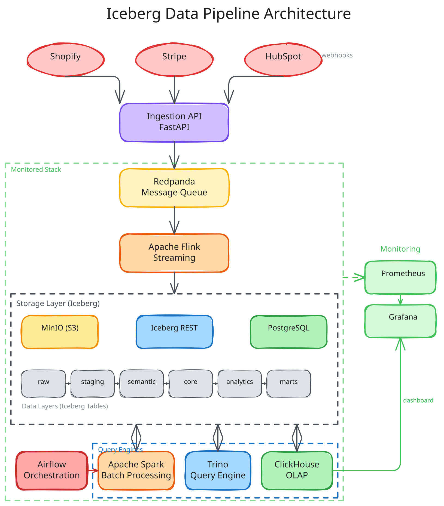
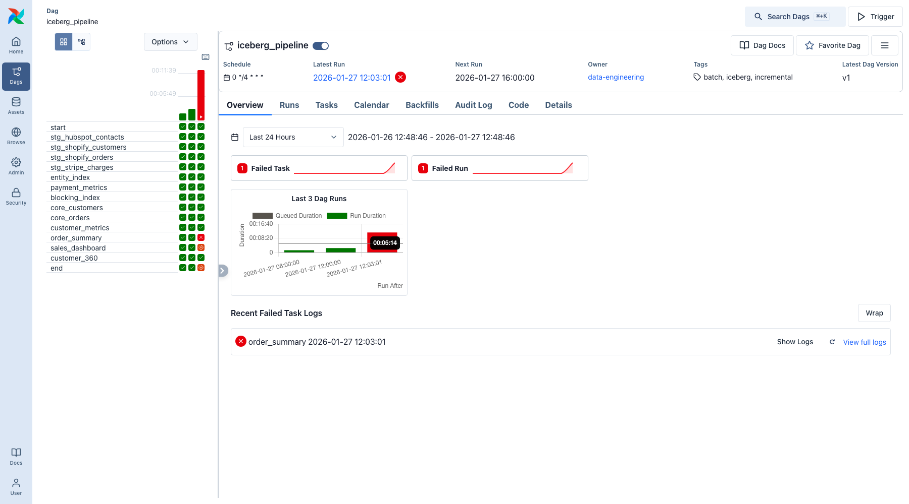
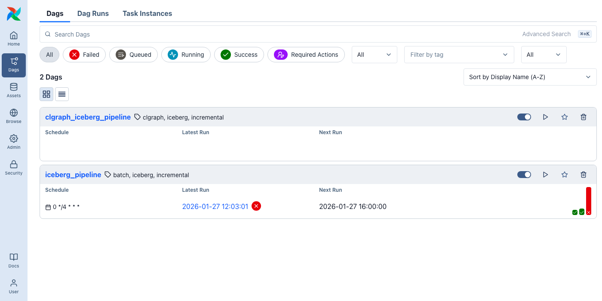
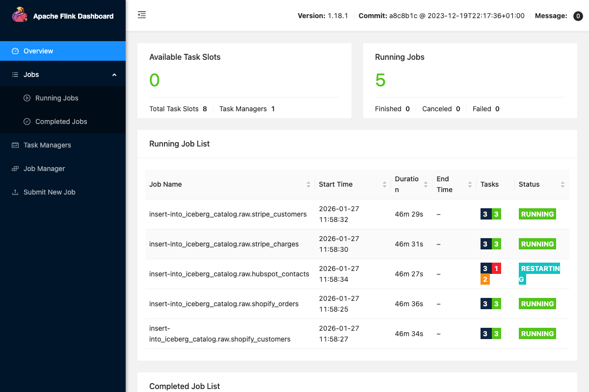
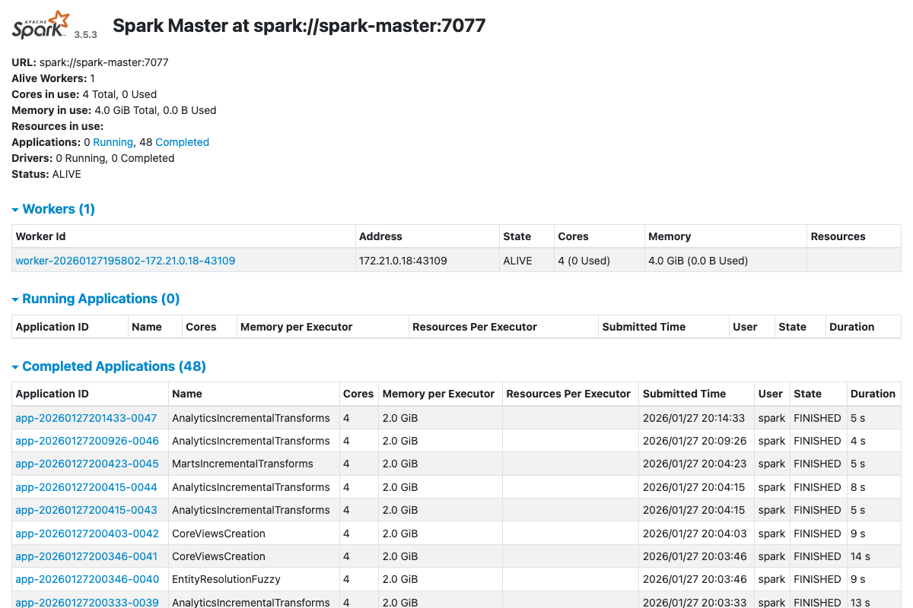
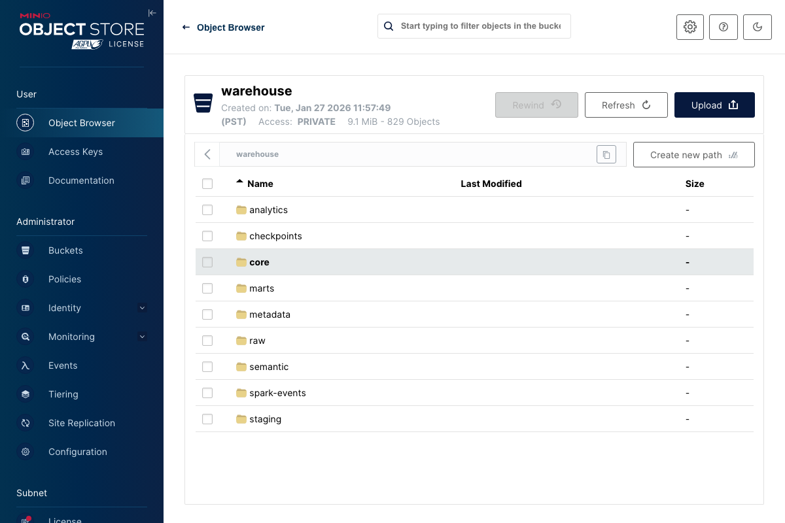
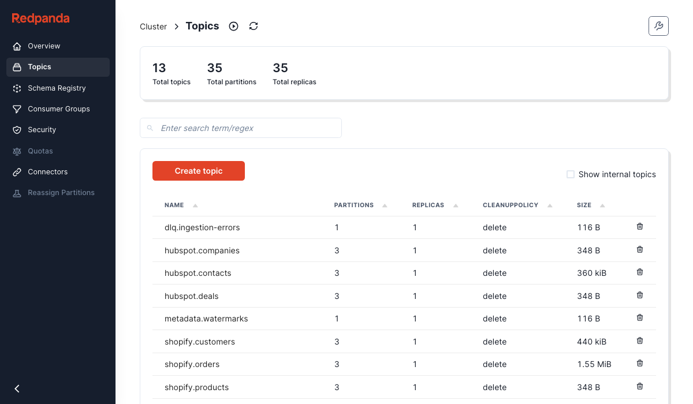
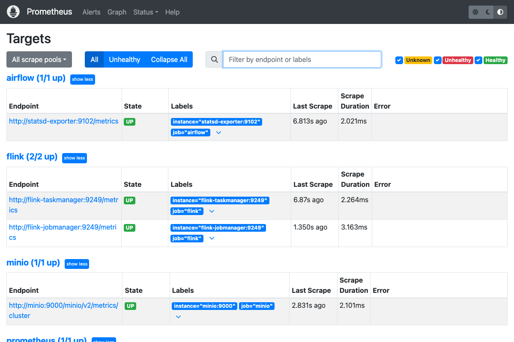
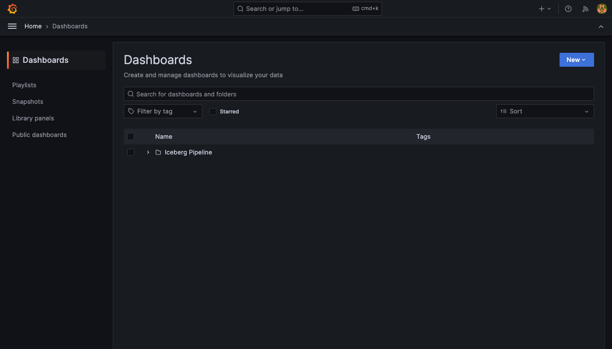

# Iceberg + Redpanda + Flink + Spark + Trino + ClickHouse + Airflow + Grafana Pipeline

This is a production-style(but not production-ready) data platform combining real-time streaming and batch processing with Apache Iceberg as the unified storage layer. Demonstrates entity resolution across five sources: Shopify, Stripe, HubSpot and Mailchimp (webhooks), plus GA4 (batch Parquet export).

**DISCLOSURE:Majority of the content are written with Claude(with human guided) ... as you can expected.**

## Architecture Diagram



## Who This Project Is For

This repository is **not a beginner tutorial**. It assumes you already understand:

- **Data warehouse concepts**: Dimensional modeling, fact/dimension tables, slowly changing dimensions
- **ETL fundamentals**: Extract-transform-load patterns, batch vs streaming trade-offs
- **SQL proficiency**: Window functions, CTEs, joins, aggregations
- **Docker basics**: Containers, volumes, compose files, networking
- **Distributed systems concepts**: Message queues, eventual consistency

However, with coding agents, the barrier is much lower now. 

**Target audience:**
- Engineers who have read articles about some of the technologies( Iceberg, Flink, or modern data stacks) used in this repo but haven't seen them work together
- Teams evaluating architecture patterns for multi-source data integration and want to see live action before fully committing engineering resources
- Teams building greenfield projects that want some jump starts
- Anyone who wants a working reference implementation rather than toy examples

## Why This Demo Exists

When I first time learned about Apache Iceberg, I feel it's a great idea and wanted to give it a try. Once I passed the quickstart section, like every other tools, I was struggled to find a personal side project that is suitable for that. There are many beginner tutorials or conceptual articles available online explaining:

- "What is Apache Iceberg?" Without showing us how to wire it with Flink streaming input AND Spark batch process and consumed by different engines.
- "Incremental processing patterns" Without telling us how to do watermark tables, partition-level updates, and failure recovery implemented together
- "Entity resolution techniques" Without explaining how blocking indexes and fuzzy matching work in a real pipeline

As I tyied to make the pipeline more real, I fell into the rabbit hole of setting more and more infra and constructing more and more complex pipelines to make everything more realiastic. Thus, I started this repo so I can start with something realiastic next time. It's a **working reference implementation** that you can run locally, inspect, and adapt—not a simplified teaching example. 

## Documentation

| Document | Purpose |
|----------|---------|
| [README.md](./README.md) | Quick start and overview (this file) |
| [docs/index.html](./docs/index.html) | Control panel — every component UI, grouped by pipeline stage. Served at http://localhost:8087 once the stack is up |
| [ARCHITECTURE.md](./ARCHITECTURE.md) | System design, infrastructure rationale, data layer philosophy |
| [infrastructure/README.md](./infrastructure/README.md) | Service-by-service guide with tool selection rationale |
| [docs/RUNBOOK.md](./docs/RUNBOOK.md) | Operational procedures and troubleshooting |

## Overview

This demo simulates a modern data platform that:
- Ingests data from **Shopify**(e-commerce store), **Stripe**(payment), **HubSpot**(CRM), and **Mailchimp**(email marketing) via webhooks
- Ingests **GA4**(web analytics) from Parquet exports in batch, standing in for a BigQuery Export
- Stores data in **Apache Iceberg** tables with PostgreSQL catalog backend
- Uses **Flink SQL** for real-time streaming from Kafka to Iceberg raw layer
- Uses **Spark** for batch processing through staging → semantic → analytics → marts
- Implements **entity resolution** to unify customers across sources
- Orchestrates pipelines with **Apache Airflow**
- Supports queries from **Trino**, **Spark**, and **ClickHouse**

## Prerequisites

- **Docker** and **Docker Compose**
- **Python 3.9+** (for mock data generation)
- At least **16GB RAM** available for Docker (8GB is NOT enough)
- Ports available: 8080-8090, 9000-9001, 19092 (or you can change them)

## Quick Start

### Option 1: Automated Setup (Recommended)

Run the complete setup:

```bash
./scripts/reset_and_run.sh
```

This script will:
1. Stop all containers and remove data volumes
2. Start fresh infrastructure (MinIO, Redpanda, Iceberg REST, Flink, Spark, Airflow, Trino)
3. Submit Flink streaming jobs to write raw data to Iceberg
4. Post mock data to webhook endpoints
5. Run Spark batch jobs for all data layers (staging → semantic → analytics → marts)
6. Setup ClickHouse views for Grafana dashboards
7. Trigger the Airflow DAG

**Options:**
- `--validate` - Run with detailed validation and test counts
- `--no-reset` - Skip reset, just run the pipeline
- `--reset-only` - Only reset, don't run the pipeline
- `--no-datagen` - Don't start continuous data generation service

### Option 2: Step-by-Step Setup

#### 1. Start Infrastructure

```bash
cd infrastructure
docker-compose up -d
```

Wait for all services to be healthy:
```bash
docker-compose ps
```

#### 2. Initialize the Iceberg Catalog

The Flink jobs will automatically create databases when they run. You can also manually create them:

```bash
docker exec iceberg-flink-jobmanager /opt/flink/bin/sql-client.sh embedded -e "
    CREATE CATALOG iceberg_catalog WITH (
        'type' = 'iceberg',
        'catalog-type' = 'rest',
        'uri' = 'http://iceberg-rest:8181',
        'warehouse' = 's3a://warehouse/',
        'io-impl' = 'org.apache.iceberg.aws.s3.S3FileIO',
        's3.endpoint' = 'http://minio:9000',
        's3.path-style-access' = 'true',
        's3.access-key-id' = 'admin',
        's3.secret-access-key' = 'admin123'
    );
    USE CATALOG iceberg_catalog;
    CREATE DATABASE IF NOT EXISTS raw;
    CREATE DATABASE IF NOT EXISTS staging;
    CREATE DATABASE IF NOT EXISTS semantic;
    CREATE DATABASE IF NOT EXISTS analytics;
    CREATE DATABASE IF NOT EXISTS marts;
"
```

#### 3. Submit Flink Streaming Jobs

```bash
# Submit all raw layer ingestion jobs
# GA4 is absent here on purpose: it has no Flink job, arriving as batch Parquet
for job in shopify_orders shopify_customers stripe_charges stripe_customers \
           hubspot_contacts mailchimp_campaigns mailchimp_events mailchimp_subscribers; do
    docker exec iceberg-flink-jobmanager /opt/flink/bin/sql-client.sh embedded \
        -f "/opt/flink/jobs/${job}_full.sql" &
    sleep 2
done
```

#### 4. Generate and Post Mock Data

```bash
# Install dependencies
python3 -m venv .venv
source .venv/bin/activate
pip install -r datagen/requirements.txt -r scripts/requirements.txt

# Post mock data to webhook endpoints
python scripts/post_mock_data.py \
    --url http://localhost:8090 \
    --shopify-customers 50 \
    --shopify-orders 100 \
    --stripe-charges 80 \
    --hubspot-contacts 40 \
    --seed 42
```

#### 5. Run Spark Batch Jobs

```bash
# Staging layer
docker exec iceberg-spark-master /opt/spark/bin/spark-submit \
    --master spark://spark-master:7077 \
    --conf 'spark.sql.extensions=org.apache.iceberg.spark.extensions.IcebergSparkSessionExtensions' \
    --conf 'spark.sql.catalog.iceberg=org.apache.iceberg.spark.SparkCatalog' \
    --conf 'spark.sql.catalog.iceberg.type=rest' \
    --conf 'spark.sql.catalog.iceberg.uri=http://iceberg-rest:8181' \
    --conf 'spark.sql.catalog.iceberg.warehouse=s3a://warehouse/' \
    --conf 'spark.sql.catalog.iceberg.io-impl=org.apache.iceberg.aws.s3.S3FileIO' \
    --conf 'spark.sql.catalog.iceberg.s3.endpoint=http://minio:9000' \
    --conf 'spark.sql.catalog.iceberg.s3.access-key-id=admin' \
    --conf 'spark.sql.catalog.iceberg.s3.secret-access-key=admin123' \
    --conf 'spark.sql.catalog.iceberg.s3.path-style-access=true' \
    /opt/spark/jobs/staging_batch.py --table all --mode full

# Entity resolution (semantic layer)
docker exec iceberg-spark-master /opt/spark/bin/spark-submit \
    --master spark://spark-master:7077 \
    # ... same configs ...
    /opt/spark/jobs/entity_backfill.py --mode initial

# Analytics layer
docker exec iceberg-spark-master /opt/spark/bin/spark-submit \
    # ... same configs ...
    /opt/spark/jobs/analytics_incremental.py --table all --mode full

# Marts layer
docker exec iceberg-spark-master /opt/spark/bin/spark-submit \
    # ... same configs ...
    /opt/spark/jobs/marts_incremental.py --table all --mode full
```

#### 6. Trigger Airflow DAG

```bash
docker exec iceberg-airflow-scheduler airflow dags trigger iceberg_pipeline
```

## Service URLs

| Service | URL | Credentials |
|---------|-----|-------------|
| **Homepage** | **http://localhost:8087** | - |
| Airflow | http://localhost:8086 | admin / admin123 |
| Grafana | http://localhost:3000 | admin / admin123 |
| Prometheus | http://localhost:9090 | - |
| Pushgateway | http://localhost:9091 | - |
| Spark Master | http://localhost:8084 | - |
| Flink Dashboard | http://localhost:8083 | - |
| MinIO Console | http://localhost:9001 | admin / admin123 |
| Redpanda Console | http://localhost:8080 | - |
| Trino | http://localhost:8085 | - |
| ClickHouse | http://localhost:8123/play | - |
| Iceberg REST Catalog | http://localhost:8181 | - |
| Ingestion API | http://localhost:8090/docs | - |

Every host port is overridable from `infrastructure/.env` — useful when a local
dev server already owns one. Grafana (`EXTERNAL_GRAFANA_PORT`) and Redpanda's
Schema Registry / HTTP Proxy / Admin API
(`EXTERNAL_REDPANDA_SCHEMA_REGISTRY_PORT`, `EXTERNAL_REDPANDA_HTTP_PROXY_PORT`,
`EXTERNAL_REDPANDA_ADMIN_PORT`) collide most often, since 3000/8081/8082 are
common defaults elsewhere. Only the host side moves; container-internal
addresses such as `redpanda:8081` are unaffected.

## Observing the Pipeline in Action

Once the pipeline is running, we can watch data flow through each component in real-time.

### Watch Data Flow End-to-End

**1. Ingestion → Kafka (Redpanda Console)**
- Open http://localhost:8080
- Navigate to Topics → select `shopify.orders`
- Watch messages arrive as webhooks are received
- See consumer lag if Flink falls behind

**2. Kafka → Raw Layer (Flink Dashboard)**
- Open http://localhost:8083
- View running jobs and their throughput
- Check checkpoint status for exactly-once guarantees
- Monitor backpressure indicators

**3. Raw → Staging → Analytics (Spark Master)**
- Open http://localhost:8084
- Watch batch jobs execute
- View executor metrics, shuffle read/write
- Check completed/failed applications

**4. Pipeline Orchestration (Airflow)**
- Open http://localhost:8086 (admin/admin123)
- View DAG: `iceberg_pipeline`
- See task dependencies and execution order
- Check task logs for any failures

**5. Storage (MinIO Console)**
- Open http://localhost:9001 (admin/admin123)
- Browse `warehouse` bucket
- See Iceberg data files organized by table
- Watch file count grow as data arrives

### Monitoring Dashboards (Grafana)

Open http://localhost:3000 (admin/admin123) for pre-built dashboards:

| Dashboard | What It Shows |
|-----------|---------------|
| **Streaming Infrastructure** | Flink jobs, consumer lag, throughput, backpressure |
| **Streaming Business** | Message counts, rates per topic, recent orders/payments |
| **Batch Infrastructure** | Airflow DAG metrics, Spark job status |
| **Batch Business** | Customer 360, sales summary, customer metrics from marts |

We should see numbers increasing in the **Streaming Business** dashboard in real time.

### Metrics and Alerting

Metrics reach Prometheus two ways. Long-lived services are scraped — Redpanda,
MinIO, Trino, ClickHouse, Flink, the ingestion API. Batch Spark jobs and Airflow
DAG runs **push** to the Pushgateway instead, because a `spark-submit` driver
lives only for the duration of its task and cannot be scraped. The Iceberg REST
catalog serves no `/metrics` endpoint at all, so its liveness comes from a
blackbox probe.

Every metric the pipeline emits is declared in `jobs/spark/metrics/registry.py`,
and `tests/test_metrics_registry.py` fails if an alert rule references anything
outside it. That guardrail exists because the alert file once shipped with 13 of
its 15 rules pointing at series nothing produced — the monitoring read as
configured while emitting nothing.

```bash
# Publish table, entity, and maintenance metrics by hand
docker exec iceberg-spark-master /opt/spark/bin/spark-submit \
  /opt/spark/jobs/export_metrics.py --dry-run   # print, don't push

# Confirm every alert rule evaluates (health: ok, not unknown)
curl -s localhost:9090/api/v1/rules | python3 -c "
import json,sys
for g in json.load(sys.stdin)['data']['groups']:
    for r in g['rules']:
        print(f\"{r['name']:28} {r['health']:8} {r.get('state')}\")
"
```

Alert response procedures live in [docs/RUNBOOK.md](./docs/RUNBOOK.md#metrics-and-alerting);
every alert's `runbook_url` points into it.

### Quick Health Check

Run this to verify all components are working:

```bash
# Check service health
curl -s http://localhost:9000/minio/health/live && echo "MinIO: OK"
curl -s http://localhost:8181/v1/config | jq -r '.defaults."warehouse"' && echo "Iceberg Catalog: OK"
curl -s http://localhost:8083/jobs/overview | jq -r '.jobs | length' | xargs -I {} echo "Flink Jobs: {} running"
docker exec iceberg-redpanda rpk topic list | wc -l | xargs -I {} echo "Kafka Topics: {}"

# Check data counts across layers
docker exec iceberg-trino trino --execute "
SELECT 'raw.shopify_orders' as tbl, COUNT(*) as cnt FROM iceberg.raw.shopify_orders
UNION ALL SELECT 'staging.stg_shopify_orders', COUNT(*) FROM iceberg.staging.stg_shopify_orders
UNION ALL SELECT 'analytics.order_summary', COUNT(*) FROM iceberg.analytics.order_summary
"
```

## UI Screenshots

### Airflow DAG

The pipeline orchestration showing task dependencies and run status:



DAG list showing both pipelines:



### Flink Streaming

Real-time streaming jobs consuming from Kafka and writing to Iceberg:



### Spark Master

Batch processing cluster status:



### MinIO Storage

Object storage browser showing Iceberg data files:



### Redpanda Console

Kafka topics receiving webhook events:



### Monitoring

Prometheus targets for metrics collection:



Grafana dashboards:



---

## Querying Data

### Using Trino

```bash
docker exec -it iceberg-trino trino

# List all tables
SHOW TABLES FROM iceberg.staging;

# Query staging data
SELECT * FROM iceberg.staging.stg_shopify_orders LIMIT 10;

# Query analytics
SELECT * FROM iceberg.analytics.order_summary LIMIT 10;
```

### Using Spark SQL

```bash
docker exec -it iceberg-spark-master /opt/spark/bin/spark-sql \
    --conf 'spark.sql.catalog.iceberg=org.apache.iceberg.spark.SparkCatalog' \
    --conf 'spark.sql.catalog.iceberg.type=rest' \
    --conf 'spark.sql.catalog.iceberg.uri=http://iceberg-rest:8181'
```

## Data Pipeline Layers

| Layer | Description | Tables |
|-------|-------------|--------|
| **Raw** | Append-only source events | `raw.shopify_orders`, `raw.shopify_customers`, `raw.stripe_charges`, `raw.stripe_customers`, `raw.hubspot_contacts`, `raw.mailchimp_campaigns`, `raw.mailchimp_events`, `raw.mailchimp_subscribers`, `raw.ga4_events` |
| **Staging** | Cleaned and typed data | `staging.stg_shopify_orders`, `staging.stg_shopify_customers`, `staging.stg_stripe_charges`, `staging.stg_stripe_customers`, `staging.stg_hubspot_contacts`, `staging.stg_mailchimp_campaigns`, `staging.stg_mailchimp_events`, `staging.stg_mailchimp_subscribers`, `staging.stg_ga4_events`, `staging.stg_ga4_sessions` |
| **Semantic** | Entity resolution | `semantic.entity_index`, `semantic.blocking_index` |
| **Analytics** | Aggregated metrics | `analytics.customer_metrics`, `analytics.order_summary`, `analytics.payment_metrics`, `analytics.campaign_metrics`, `analytics.ga4_engagement_metrics`, `analytics.ga4_engagement_by_channel`, `analytics.ga4_page_performance`, `analytics.ga4_funnel_analysis` |
| **Marts** | Business-ready views | `marts.customer_360`, `marts.sales_dashboard_daily`, `marts.campaign_dashboard`, `marts.ga4_engagement_dashboard` |

All layers except raw arrive via Spark batch jobs. Raw is fed by Flink SQL for the
four webhook sources, and by `ga4_batch_ingest.py` for GA4, which reads Parquet
exports from the volume mounted at `/opt/spark/data`.

### PII Masking

Direct identifiers (email, phone, name, address) are tokenized at the staging
boundary. `raw.*` retains plaintext by design -- staging.* and every layer
below it (semantic, core, analytics, marts, ClickHouse, Grafana) hold only
deterministic tokens such as `email_token`, never the plaintext column. Only
`semantic.pii_vault` maps a token back to plaintext, and the only path to it
is the audited `detokenize()` call documented in
`docs/RUNBOOK.md`. See `docs/DESIGN_PII_MASKING.md` for the full design,
including what this demonstration does not defend against (raw-layer access,
a leaked pepper) -- collected in that doc's Production Gaps table.

Requires `PII_TOKEN_PEPPER` to be set in `infrastructure/.env` (see
`.env.example`); every staging job fails immediately without it.

## Configuration

### Environment Variables

Create `infrastructure/.env` to customize:

```bash
# MinIO
MINIO_ROOT_USER=admin
MINIO_ROOT_PASSWORD=admin123

# PII tokenization pepper -- required, every staging job fails without it.
# Generate with: openssl rand -hex 32
PII_TOKEN_PEPPER=change-me-generate-with-openssl-rand-hex-32

# Airflow
AIRFLOW_POSTGRES_USER=airflow
AIRFLOW_POSTGRES_PASSWORD=airflow123

# Mock Data Scale
SHOPIFY_CUSTOMERS=50
SHOPIFY_ORDERS=100
STRIPE_CUSTOMERS=30
STRIPE_CHARGES=80
HUBSPOT_CONTACTS=40
```

## Testing

```bash
# Whole suite
./scripts/run_tests.sh

# One file, or any pytest arguments
./scripts/run_tests.sh tests/test_ga4_dedup.py
./scripts/run_tests.sh -k dedup -vv
```

Tests run inside the project's Spark image, which already carries Java 11, Spark
3.5.3, and the Iceberg runtime jars. Nothing else needs to be running: the suite
uses a hadoop-type Iceberg catalog in a temp directory, so MinIO, Postgres, and
the REST catalog can all be down. The script builds the image if it is missing.

| Suite | Covers |
|-------|--------|
| `tests/test_ga4_provider.py` | GA4 export generation: schema, timestamps, session coherence, seed reproducibility |
| `tests/test_ga4_dedup.py` | Staging deduplication in both full and incremental modes |
| `tests/test_ga4_entity_resolution.py` | GA4 users joining entity resolution; blocking-index cardinality |
| `tests/test_ga4_e2e.py` | Parquet → raw → staging → semantic → analytics → marts, plus ingest idempotency |

The end-to-end suite calls the same functions the Airflow DAG invokes, so a
signature drift between a job and its caller fails here rather than in a
scheduled run.

For row-count validation against a *running* stack, use
`./scripts/validate_tables.sh` instead.

### Verifying the Airflow DAG

The unit suite and `reset_and_run.sh` both exercise the pipeline in **full**
mode. The DAG runs everything in **incremental** mode, which is a genuinely
different code path — and the one a 4-hour schedule actually uses. Verify it
separately:

```bash
docker exec iceberg-airflow-scheduler airflow dags trigger iceberg_pipeline
docker exec iceberg-airflow-scheduler airflow dags list-runs iceberg_pipeline
```

**Trigger it twice.** A single green run proves very little: appending duplicate
rows is not an error, so a job can double a table and still report success. The
real check is that a second run leaves every row count identical.

```bash
./scripts/validate_tables.sh   # before
# ... trigger, wait for success ...
./scripts/validate_tables.sh   # counts must match exactly
```

If a count grows on the second run, some job is reading its whole source table
and appending the result — see the idempotency contract in
[ARCHITECTURE.md](./ARCHITECTURE.md#the-idempotency-contract).

## Troubleshooting

### Common Issues

**1. Services fail to start**
```bash
# Check logs
docker-compose logs -f <service-name>

# Restart specific service
docker-compose restart <service-name>
```

**2. Flink jobs fail**
```bash
# Check Flink logs
docker logs iceberg-flink-jobmanager

# Check if Kafka topics exist
docker exec iceberg-redpanda rpk topic list
```

**3. Spark jobs fail with S3 errors**

Ensure all Iceberg S3 configurations are passed:
```bash
--conf 'spark.sql.catalog.iceberg.s3.endpoint=http://minio:9000'
--conf 'spark.sql.catalog.iceberg.s3.access-key-id=admin'
--conf 'spark.sql.catalog.iceberg.s3.secret-access-key=admin123'
--conf 'spark.sql.catalog.iceberg.s3.path-style-access=true'
```

**4. Tables not found**
```bash
# Check Iceberg catalog
docker exec iceberg-airflow-postgres psql -U airflow -d iceberg_catalog -c \
    "SELECT table_namespace, table_name FROM iceberg_tables;"
```

### Reset Everything

```bash
./scripts/reset_and_run.sh
```

Or manually:
```bash
cd infrastructure
docker-compose down --remove-orphans
docker volume rm iceberg-demo-minio-data iceberg-demo-redpanda-data \
    iceberg-demo-flink-checkpoints iceberg-demo-airflow-postgres-data
docker-compose up -d
```

## Directory Structure

```
iceberg-incremental-demo/
├── README.md                    # This file
├── ARCHITECTURE.md              # Detailed architecture documentation
├── infrastructure/              # Docker services
│   ├── docker-compose.yml       # All service definitions
│   ├── postgres/                # PostgreSQL init scripts
│   ├── redpanda/                # Kafka topic initialization
│   ├── flink/                   # Flink configuration
│   └── airflow/                 # Airflow configuration
├── datagen/                     # Mock data generation
│   └── providers/               # Source-specific Faker providers
├── jobs/                        # ETL jobs
│   ├── flink/                   # Flink SQL streaming jobs
│   └── spark/                   # Spark batch jobs
├── airflow/                     # Airflow DAGs
│   └── dags/                    # Pipeline definitions
├── sql/                         # SQL transformations
│   ├── 01_staging/
│   ├── 02_semantic/
│   ├── 03_core/
│   ├── 04_analytics/
│   └── 05_marts/
├── docs/
│   ├── index.html               # Control panel (open in a browser)
│   ├── ARCHITECTURE.md          # see repo root
│   └── RUNBOOK.md               # Operational procedures
├── scripts/                     # Utility scripts
│   ├── reset_and_run.sh         # Main setup script (--help for options)
│   ├── run_tests.sh             # Run the test suite in the Spark image
│   ├── validate_tables.sh       # Quick table validation
│   └── post_mock_data.py        # Mock data generator
├── tests/                       # Pytest suite
│   ├── conftest.py              # SparkSession and sample-data fixtures
│   └── pipeline_tables.py       # Iceberg DDL and row-insert helpers
├── requirements-dev.txt         # Test dependencies
└── schemas/                     # API JSON schemas
```

## Related Documentation

- [Architecture Documentation](./ARCHITECTURE.md)
- [Infrastructure README](./infrastructure/README.md)
- [Runbook](./docs/RUNBOOK.md)

## API Documentation Sources

- [Shopify REST Admin API](https://shopify.dev/docs/api/admin-rest/2024-10/resources/order)
- [Stripe API Reference](https://docs.stripe.com/api)
- [HubSpot CRM API](https://developers.hubspot.com/docs/api/crm/contacts)
